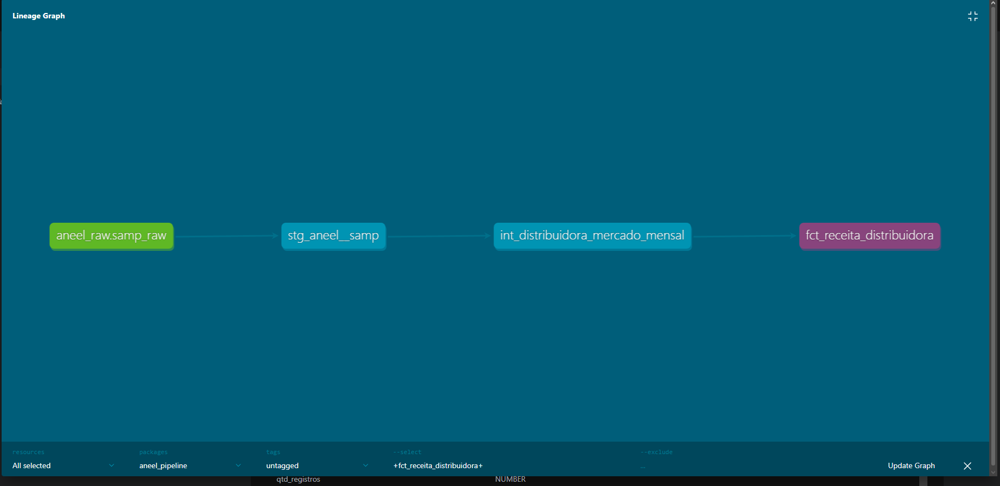

# Pipeline ELT: Snowflake + dbt + Airflow

[](https://github.com/juansrodrigues/pipeline-elt-aneel/actions/workflows/ci.yml)


Pipeline ELT end-to-end com **2,67 milhões de linhas** de dados reais da ANEEL —
extraídos com Python, armazenados no AWS S3, carregados no Snowflake e transformados com dbt.
Toda a orquestração é feita pelo Apache Airflow rodando em Docker.

---

## Arquitetura

```
┌─────────────────────────────────────────────────────────────────┐
│                  Apache Airflow  (orquestrador)                  │
│          agenda · monitora · retry automático · tasks paralelas  │
└────────────────┬──────────────────────────┬─────────────────────┘
                 │                          │
                 ▼                          ▼
   extract_aneel_2024            extract_aneel_2025
   Python → AWS S3               Python → AWS S3
   1.303.566 linhas              1.371.594 linhas
                 │                          │
                 └────────────┬─────────────┘
                              ▼
                   ┌─────────────────────┐
                   │    AWS S3  (raw)     │
                   │  aneel/samp/         │
                   │  ├── ano=2024/       │
                   │  └── ano=2025/       │
                   └──────────┬──────────┘
                              │  COPY INTO
                              ▼
                   ┌─────────────────────┐
                   │ Snowflake  schema   │
                   │        RAW          │
                   │  samp_raw           │
                   │  2.675.160 linhas   │
                   └──────────┬──────────┘
                              │
                 ┌────────────▼────────────┐
                 │       dbt models        │
                 │                         │
                 │  staging/               │
                 │  stg_aneel__samp        │  → view
                 │         │               │
                 │  intermediate/          │
                 │  int_distrib_mensal     │  → view
                 │         │               │
                 │  marts/                 │
                 │  fct_receita_distrib    │  → table
                 └─────────────────────────┘
                              │
                   8 testes · CI/CD ✅
```

---

## Lineage Graph



> Gerado automaticamente pelo `dbt docs generate` — mostra a cadeia completa de dependências do source até o mart.

---

## Stack Técnica

| Camada | Tecnologia | Detalhe |
|---|---|---|
| Extração | Python 3.12 | `requests` + `pandas` + `boto3` |
| Armazenamento raw | AWS S3 | Particionado por `ano` e `extracted_at` |
| Data warehouse | Snowflake Standard | Schemas: `RAW` / `STAGING` / `MARTS` |
| Transformação | dbt 1.8 | 3 modelos · 8 testes de qualidade |
| Orquestração | Apache Airflow 2.9 | `CeleryExecutor` · tasks paralelas · retry |
| Infraestrutura local | Docker Compose | 5 serviços: webserver · scheduler · worker · postgres · redis |
| CI/CD | GitHub Actions | `dbt compile` + `dbt test` em todo push |

---

## Volume de dados

| Ano | Linhas | Tamanho no S3 |
|---|---|---|
| 2024 | 1.303.566 | ~340 MB |
| 2025 | 1.371.594 | ~360 MB |
| **Total** | **2.675.160** | **~700 MB** |

**Fonte:** [ANEEL — Sistema de Acompanhamento de Mercado (SAMP)](https://dadosabertos.aneel.gov.br/dataset/samp)
Dados públicos de faturamento e arrecadação das distribuidoras de energia elétrica do Brasil.

---

## Modelos dbt

```
aneel_raw.samp_raw                    ← source (Snowflake RAW)
    └── stg_aneel__samp               ← staging (view)
            limpeza de strings, cast de datas, conversão de valores
            └── int_distribuidora_mercado_mensal   ← intermediate (view)
                    agregação mensal por distribuidora, classe e tipo de mercado
                    └── fct_receita_distribuidora  ← mart (table)
                            receita total em R$ por distribuidora/mês
                            ranking de desempenho entre distribuidoras
```

### Testes de qualidade (8 testes — todos passando ✅)

| Modelo | Coluna | Teste |
|---|---|---|
| `fct_receita_distribuidora` | `mes_competencia` | `not_null` |
| `fct_receita_distribuidora` | `sigla_distribuidora` | `not_null` |
| `fct_receita_distribuidora` | `receita_total_reais` | `not_null` |
| `fct_receita_distribuidora` | `ranking_receita_mes` | `not_null` |
| `stg_aneel__samp` | `dat_competencia` | `not_null` |
| `stg_aneel__samp` | `sigla_distribuidora` | `not_null` |
| `source: samp_raw` | `dat_competencia` | `not_null` |
| `source: samp_raw` | `sig_agente_distribuidora` | `not_null` |

---

## DAG Airflow

```
elt_aneel_samp
│
├── extract_aneel_2024 ──┐
│   Python → S3          ├──► log_conclusao
└── extract_aneel_2025 ──┘
    Python → S3

Schedule:  0 6 1 * *   (todo dia 1 do mês às 06h UTC)
Retries:   2 tentativas com intervalo de 5 minutos
Executor:  CeleryExecutor (tasks paralelas)
```

---

## Como rodar localmente

### Pré-requisitos

- Docker Desktop com WSL2 (Windows) ou Docker Engine (Linux/Mac)
- Python 3.10+
- Conta AWS — [Free Tier](https://aws.amazon.com/free/) é suficiente
- Conta Snowflake — [trial gratuito](https://trial.snowflake.com)

### 1. Clone o repositório

```bash
git clone https://github.com/juansrodrigues/pipeline-elt-aneel.git
cd pipeline-elt-aneel
```

### 2. Configure as variáveis de ambiente

```bash
cp .env.example .env
# Edite .env com suas credenciais AWS e Snowflake
```

### 3. Suba o Airflow

```bash
cd airflow
docker compose --env-file ../.env up -d
# Acesse: http://localhost:8080
# Login: admin / admin123
```

### 4. Execute a extração

```bash
# Manualmente via script
python3 extract/extract_aneel.py

# Ou pelo Airflow: ative o DAG elt_aneel_samp na interface
```

### 5. Configure e rode o dbt

```bash
# Configure ~/.dbt/profiles.yml com suas credenciais Snowflake
cd dbt
SNOWFLAKE_PASSWORD="..." dbt run    # cria os modelos
SNOWFLAKE_PASSWORD="..." dbt test   # roda os 8 testes
SNOWFLAKE_PASSWORD="..." dbt docs generate && dbt docs serve --port 8081
```

---

## Decisões técnicas

**Por que Airflow com CeleryExecutor?**
Tasks paralelas — `extract_aneel_2024` e `extract_aneel_2025` rodam simultaneamente, reduzindo o tempo total pela metade. O CeleryExecutor também é o padrão em ambientes de produção, tornando o projeto diretamente transferível para uso real.

**Por que três camadas no dbt?**
Staging isola a fonte (fácil de debugar), intermediate concentra a lógica de negócio (fácil de alterar sem quebrar outros modelos), e marts são a API estável consumida por ferramentas de BI. Cada camada tem responsabilidade única.

**Por que S3 como landing zone antes do Snowflake?**
Garante uma cópia imutável dos dados brutos. Se o `COPY INTO` falhar, os dados não se perdem. Também desacopla extração de carga — padrão em pipelines ELT de produção e necessário para replay e auditoria.

**Por que particionamento por data no S3?**
O padrão `ano={ano}/extracted_at={YYYY}/{MM}/{DD}/` permite cargas incrementais futuras — o Snowflake consegue selecionar apenas as partições novas em vez de reprocessar tudo.

---

## Autor

**Juan de Sousa Rodrigues** — Data Engineer

[](https://linkedin.com/in/juansrodrigues)
[](mailto:juanrodrigues.eng@gmail.com)
